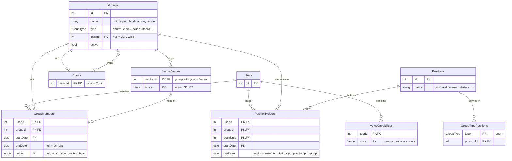
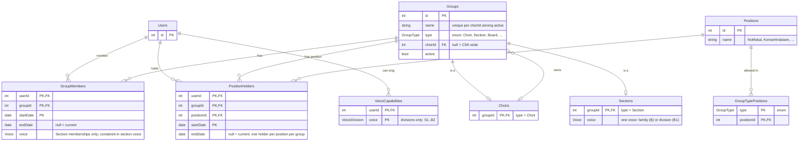

## Revised scheme (v2)

#### Terminology

| Term                | Meaning                                                                                                                                   | In the schema                         |
| ------------------- | ----------------------------------------------------------------------------------------------------------------------------------------- | ------------------------------------- |
| **Voice**           | A musical concept: the line someone sings (B1, T2, ...). An attribute, **never** a group of people.                                       | `Voice` enum                          |
| **Part**            | The musical voice family S/A/T/B. Derived from a voice (B1 → B). Also never a group.                                                      | `Part` enum, fixed mapping from Voice |
| **Section**         | A social concept: the actual people in one choir who sing a given voice (or voices). Always a group.                                      | Group with `type = Section`           |
| **Choir**           | One of the choirs (MK, DK, KK). Always a group.                                                                                           | Group with `type = Choir`             |
| **Membership**      | Being in a group, over a period of time.                                                                                                  | `GroupMembers`                        |
| **Position**        | A named organisational position in a group (Notfiskal, Konsertmästare, Sexmästare, Stämförälder). Swedish: *post*. Not a permission role. | `Positions`                           |
| **Position holder** | A member holding a position in a group, over its own period of time, independent of the membership.                                       | `PositionHolders`                     |
| **News post**       | An item in the news feed. "Post" is reserved for this; never used for positions.                                                          | `NewsPosts` (news model)              |

Every choir has exactly **four sections**. In most choirs each section sings **one** voice (MK: T1, T2, B1, B2). In the chamber choir a section can sing **two** voices (KKB sings B1 + B2). A singer always has **one** voice.

Groups are either **CSK-wide** (`choirId = null`) or **belong to a choir** (`choirId` set). There is no deeper hierarchy: every subgroup belongs directly to a choir.

A person can hold **several positions in the same group** (e.g. Notfiskal + Konsertmästare in KK). Each position has **one holder** per group at a time.

"Position" means an organisational position only. If standing order / formation is ever modelled, call it **Placement** or **Formation**.

``` ER Scheme
Users(_id_, ...)

// Enum so the code can branch on it with type-safe comparisons.
// Storage: native Postgres enum (easy to ADD a value, awkward to remove/rename)
// or text + CHECK constraint (easier to change). Either maps to an enum in code.
Enum GroupType:
	Choir
	Section         // the people in a choir singing a given voice/voices (4 per choir)
	Board
	Committee
	GigGroup
	Gigmästeri
	Sexmästeri
	Rodd
	Fest
	Rephelg
	Konsert

Groups(_id_, name, type, choirId?, active)
	type     -> GroupType
	choirId  -> Choirs.groupId   // the choir this group belongs to. null = CSK-wide.
	                             // A Choir group itself has choirId = null.

	// Every choir has a "Roddgrupp" etc., so names are unique per choir, not globally.
	// CSK-wide groups have choirId = null, and NULLs are not equal in a unique index:
	// use NULLS NOT DISTINCT (Postgres 15+) or an index on COALESCE(choirId, 0)
	UNIQUE (name, choirId) NULLS NOT DISTINCT WHERE active

// A choir IS a group (1:1 extension), so membership, news targeting
// and permissions work the same everywhere
Choirs(_groupId_, ...choir-specific fields)
	groupId -> Groups.id

--- Voices (musical) ---

// Two separate enums so Part and Voice can't be mixed up in code
Enum Part:  S, A, T, B
Enum Voice: S1, S2, A1, A2, T1, T2, B1, B2
// Fixed mapping Voice -> Part in code (B1 -> B, T2 -> T, ...). Not stored.

// What a user CAN sing (e.g. finding a T2 to cover a gig). Real voices only.
VoiceCapabilities(_userId_, _voice_)
	userId -> Users.id
	voice  -> Voice

--- Sections (social) ---

// Which voices a section sings. A section is defined by its voices, not by a fixed kind.
//   MKB1: one row  (B1)
//   KKB:  two rows (B1, B2)
// A section group with type = Section must have at least one row here.
SectionVoices(_sectionId_, _voice_)
	sectionId -> Groups.id       // a group with type = Section
	voice     -> Voice

--- Membership ---

// Being in a group. Dated, so history is kept (Styret 25/26 vs 26/27, alumni, voice changes).
// Taking or leaving a position does NOT touch this table.
GroupMembers(_userId_, _groupId_, _startDate_, endDate?, voice?)
	userId -> Users.id
	groupId -> Groups.id
	voice  -> Voice              // the singer's ONE voice; only set on Section memberships
	endDate = null -> current member

	// The singer's voice must be one the section sings.
	// Composite FK: when voice is NULL the FK is not checked (MATCH SIMPLE),
	// so non-section memberships are unaffected. Enforced by the database.
	(groupId, voice) -> SectionVoices(sectionId, voice)

	// At most one CURRENT membership per user per group (history rows are fine)
	UNIQUE (userId, groupId) WHERE endDate IS NULL

--- Positions ---

// Named organisational positions in a group (Swedish: poster). Not permission roles.
Positions(_id_, name)
	// e.g. Ordförande, PR-mästare, Gigmästare, Sexmästare, Sexmästarinna,
	//      Conductor, Notfiskal, Konsertmästare, Stämförälder

// Optional: which positions are allowed in which kind of group
// (stops e.g. "Conductor" in a festgrupp)
GroupTypePositions(_type_, _positionId_)
	type       -> GroupType
	positionId -> Positions.id

// Who holds which position, in which group, when. Own term, independent of the membership.
PositionHolders(_userId_, _groupId_, _positionId_, _startDate_, endDate?)
	userId     -> Users.id
	groupId    -> Groups.id
	positionId -> Positions.id
	endDate = null -> current holder

	// One holder per position per group at a time.
	// A person may hold several different positions in the same group.
	// Gives "one stämförälder per section" and "one conductor per choir" for free.
	UNIQUE (groupId, positionId) WHERE endDate IS NULL
```

### Example placement

| Group                                    | type                    | choirId | SectionVoices                             |
| ---------------------------------------- | ----------------------- | ------- | ----------------------------------------- |
| Styret                                   | Board                   | null    |                                           |
| Committees, gig groups                   | Committee / GigGroup    | null    |                                           |
| Gigmästeri, Sexmästeri                   | Gigmästeri / Sexmästeri | null    |                                           |
| CSK konsertgrupp                         | Konsert                 | null    |                                           |
| MK konsertgrupp                          | Konsert                 | MK      |                                           |
| MK roddgrupp / festgrupp / rephelgsgrupp | Rodd / Fest / Rephelg   | MK      |                                           |
| MK, DK, KK                               | Choir                   | null    |                                           |
| MKT1, MKT2, MKB1, MKB2                   | Section                 | MK      | T1 / T2 / B1 / B2 (one each)              |
| DKS1, DKS2, DKA1, DKA2                   | Section                 | DK      | S1 / S2 / A1 / A2 (one each)              |
| KKS, KKA, KKT, KKB                       | Section                 | KK      | (S1, S2) / (A1, A2) / (T1, T2) / (B1, B2) |

Structure: one level. A group is CSK-wide or belongs to a choir.

```
CSK-wide: Styret, committees, gig groups, Gigmästeri, Sexmästeri, CSK konsertgrupp

MK  (Choir)                               KK  (Choir)              ← positions: Conductor, Notfiskal, Konsertmästare
├─ MKT1, MKT2, MKB1, MKB2  (Sections)     ├─ KKS, KKA, KKT, KKB  (Sections)  ← singers here, each with ONE voice
└─ MK konsertgrupp, roddgrupp, ...        └─ KK konsertgrupp, roddgrupp, ...
```

Example: Sara sings B1 in KK and holds two positions there.

```
GroupMembers   (Sara, KK,  2023-08-20)
GroupMembers   (Sara, KKB, 2023-08-20, voice = B1)
PositionHolders(Sara, KK,  Notfiskal,      2025-09-01)
PositionHolders(Sara, KK,  Konsertmästare, 2026-09-01)
```

More examples:

```
GroupMembers   (Erik, KK,  2020-01-10)                   -- conductor, doesn't sing: choir row only
PositionHolders(Erik, KK,  Conductor,    2020-01-10)

GroupMembers   (Olof, KK,  2022-08-25)
GroupMembers   (Olof, KKB, 2022-08-25, voice = B2)
PositionHolders(Olof, KKB, Stämförälder, 2025-09-01)     -- position on the section

GroupMembers   (Nils, MK,   2024-08-22)
GroupMembers   (Nils, MKB1, 2024-08-22, voice = B1)
```

Example, Sexmästeri:

| User    | Membership | Position      |
| ------- | ---------- | ------------- |
| Anna    | yes        | Sexmästare    |
| Bertil  | yes        | Sexmästarinna |
| Cecilia | yes        | (medhjälpare: no position) |
| David   | yes        | (medhjälpare: no position) |

### Rules (enforced in the app)

- **Choir groups are always CSK-wide** (`choirId = null`); only non-choir groups can belong to a choir.
- **Members of a choir's groups are members of that choir**: joining a group with `choirId = X` requires (or creates) membership in choir X. This means a news post to a choir already reaches everyone in its sections and other groups. No propagation logic needed.
- **Permissions follow the choir**: a position on a choir (e.g. Conductor) also gives rights in every group with that `choirId` (e.g. the KK conductor can publish to KKB).
- **Recipients are deduplicated** (`SELECT DISTINCT userId`): a singer in both MK and KK gets a news post targeted at both only once.
- **Sections**:
	- exactly four `Section` groups per choir
	- each section has at least one `SectionVoices` row
	- a voice belongs to at most one section per choir (B1 can't be in both KKB and another KK section)
	- these are app rules or triggers (`choirId` lives on `Groups`, not on `SectionVoices`)
- **Singers are members of the choir + exactly one section** in it, with `voice` set. The DB checks the voice is one the section sings; "one section per choir per singer" is an app rule (or trigger).
- **`voice` is only set on Section memberships**, never on choir or other group memberships.
- **Multiple choirs per singer** is allowed: one section (and one voice) in each.
- **Position holders must be current members** of the group they hold the position in. When a membership ends, end that person's positions in the group too. App rule or trigger.
- **One holder per position per group at a time**, enforced by the partial unique index. A person may hold several positions in the same group. Members without a position (medhjälpare) are simply members.
- **Stämförälder** is a position on the section: one per section.
- **Choir-specific positions** (Conductor, Notfiskal, Konsertmästare) are positions on the choir group.
- **Voice changes**:
	- within a section (KKB: B2 → B1): end the membership row, start a new one with the new voice
	- between sections (MKB2 → MKB1): end the old section membership, start a new one
	- either way history is kept
- **Board positions that lead another group** (e.g. the board's Sexmästare leads the Sexmästeri): the person holds the Sexmästare position in both Styret and the Sexmästeri (two `PositionHolders` rows, plus membership in both). The app should create/end both together when the board changes.
- Groups are archived (`active = false`), never deleted, so history stays intact.

### Belongs elsewhere

- **News targeting** → a target is a group, a part, or both:
	```
	NewsTargets(_newsPostId_, groupId?, part?)
		newsPostId -> NewsPosts.id
		groupId    -> Groups.id
		part       -> Part
		CHECK (groupId IS NOT NULL OR part IS NOT NULL)
	```
	- `groupId = MKB1`         → members of that group
	- `groupId = KK`           → members of KK (= everyone in KK's sections and groups)
	- `part = B`               → all basses in CSK: members of every section whose `SectionVoices` include a B voice (MKB1, MKB2, KKB, ...)
	- `groupId = KK, part = B` → basses in KK only
	"All basses" is deliberately not a group; it's found via `SectionVoices` + the Voice → Part mapping.
	The CSK konsertgrupp no longer links to the choir konsertgrupper. To reach "all concert groups", target several groups, or later add targeting by `type = Konsert`.
- Gigs → events model: `Gigs(_id_, ..., assignedGroupId -> Groups.id)`. The Gigmästeri plans gigs; the gig group is assigned. Gigmästeri position holders get rights to create gigs/assign groups through their position, not through a group hierarchy.
- Cleaning schedule → same pattern: `CleaningDuty(_week_, groupId -> Groups.id)`, assigned to a section (KKB, MKB1, DKS2, ...).

## ER diagram (v2)



## Revised scheme (v3)

> Self-contained spec. Supersedes v2. Target: Postgres (15+).
> Every constraint is tagged with where it is enforced: **[DB]** index/FK/CHECK, **[trigger]**, or **[app]**.

### Terminology

| Term                | Meaning                                                                                                                         | In the schema                    |
| ------------------- | ------------------------------------------------------------------------------------------------------------------------------- | -------------------------------- |
| **Voice family**    | S, A, T, B. A whole voice line in an undivided setting (B in SATB).                                                             | `VoiceFamily`                    |
| **Voice division**  | S1 … B2. A voice line when a family splits (B1 in TTBB).                                                                        | `VoiceDivision`                  |
| **Voice**           | A line someone sings, at either granularity: a family or a division. "B" and "B1" are both voices. Never a group of people.     | `Voice = VoiceFamily \| VoiceDivision` |
| **Section**         | A social concept: the actual people in one choir who sing a given voice. Always a group. A section sings exactly **one** voice.  | Group with `type = Section`      |
| **Choir**           | One of the choirs (MK, DK, KK). Always a group.                                                                                 | Group with `type = Choir`        |
| **Membership**      | Being in a group, over a period of time.                                                                                        | `GroupMembers`                   |
| **Position**        | A named organisational position in a group (Notfiskal, Konsertmästare, Sexmästare, Stämförälder). Swedish: *post*. Not a permission role. | `Positions`             |
| **Position holder** | A member holding a position in a group, over its own period of time, independent of the membership.                            | `PositionHolders`                |
| **News post**       | An item in the news feed. "Post" is reserved for this; never used for positions.                                                | `NewsPosts` (news model)         |
| **Part** (*stämma* in a score) | A line in a specific arrangement. Repertoire concept, not modelled yet. Will be labelled with a `Voice`.             | future                           |

Domain facts:
- Every choir has exactly **four sections**.
- MK sections: T1, T2, B1, B2. DK sections: S1, S2, A1, A2. KK sections: S, A, T, B.
- A singer has **one** voice per choir, which must be **contained in** their section's voice (in KKB: B1 or B2, or B if not yet placed; in MKB1: only B1).
- Groups are either **CSK-wide** (`choirId = null`) or **belong to a choir**. No deeper hierarchy.
- A person can hold **several positions in the same group**; each position has **one holder** per group at a time.
- "Position" means an organisational position only. Standing order / formation, if ever modelled, is **Placement** / **Formation**.

### Voice types (code)

```ts
type VoiceFamily   = 'S' | 'A' | 'T' | 'B'
type VoiceDivision = 'S1' | 'S2' | 'A1' | 'A2' | 'T1' | 'T2' | 'B1' | 'B2'
type Voice         = VoiceFamily | VoiceDivision

// 'B1' -> 'B', 'B' -> 'B'
function familyOf(v: Voice): VoiceFamily

// outer contains inner if they are equal, or outer is a family and inner is one of its divisions.
// contains('B', 'B1') = true, contains('B', 'B') = true, contains('B1', 'B1') = true
// contains('B1', 'B') = false, contains('B1', 'B2') = false, contains('T', 'B1') = false
function contains(outer: Voice, inner: Voice): boolean
```

DB storage: one base enum plus two **domains** (named, restricted subtypes), so the database has the same three types as the code. Domains share the base enum's values and sort order, but Postgres finds no `=` for a domain over an enum (not even against a literal or the same domain), so comparisons cast to the base type: `WHERE voice::voice = 'B1'`, `ON nt.voiceFamily::voice = ...`. Keys, `ORDER BY` and `DISTINCT` work without a cast.

```sql
CREATE TYPE   voice          AS ENUM ('S','A','T','B','S1','S2','A1','A2','T1','T2','B1','B2');
CREATE DOMAIN voice_family   AS voice CHECK (VALUE IN ('S','A','T','B'));
CREATE DOMAIN voice_division AS voice CHECK (VALUE IN ('S1','S2','A1','A2','T1','T2','B1','B2'));
```

| DB type          | TS type         | Used by                                          |
| ---------------- | --------------- | ------------------------------------------------ |
| `voice`          | `Voice`         | `Sections.voice`, `GroupMembers.voice`           |
| `voice_division` | `VoiceDivision` | `VoiceCapabilities.voice`                        |
| `voice_family`   | `VoiceFamily`   | `NewsTargets.voiceFamily` (news model)           |

The family of a voice is always derived (`familyOf`), never stored separately.

### Schema

``` ER Scheme
Users(_id_, ...)

Enum GroupType:
	Choir
	Section
	Board
	GigGroup
	Gigmästeri
	Sexmästeri
	Roddgrupp
	Festgrupp
	Rephelg
	Konsertmästeri
	Rekryteringskommitté
	Turnékommitté
	Valberedning
	Webmästeri
	Föräldramötet
	Arkivarie
	Utantillkommitté
	Övrig

// See "Voice types (code)": one base enum + two domains
Enum   voice:          S, A, T, B, S1, S2, A1, A2, T1, T2, B1, B2
Domain voice_family:   voice restricted to S, A, T, B
Domain voice_division: voice restricted to S1 … B2

Groups(_id_, name, type, choirId?, active)
	type    -> GroupType
	choirId -> Choirs.groupId    // the choir this group belongs to; null = CSK-wide
	active  default true          // archive instead of delete

	[DB] UNIQUE (name, choirId) NULLS NOT DISTINCT WHERE active

// A choir IS a group (1:1 extension)
Choirs(_groupId_, ...choir-specific fields)
	groupId -> Groups.id

// A section IS a group (1:1 extension). Sings exactly one voice.
//   KKB: voice = B     MKB1: voice = B1     DKS2: voice = S2
Sections(_groupId_, voice)
	groupId -> Groups.id
	voice   : voice               // family or division

// Being in a group, over time. Taking or leaving a position does NOT touch this table.
GroupMembers(_userId_, _groupId_, _startDate_, endDate?, voice?)
	userId  -> Users.id
	groupId -> Groups.id
	voice   : voice               // only on Section memberships: the singer's one voice
	endDate = null -> current member

	[DB] UNIQUE (userId, groupId) WHERE endDate IS NULL

// Named organisational positions (Swedish: poster)
Positions(_id_, name)
	// e.g. Ordförande, PR-mästare, Gigmästare, Sexmästare, Sexmästarinna,
	//      Conductor, Notfiskal, Konsertmästare, Stämförälder

// Optional: which positions are allowed in which kind of group
GroupTypePositions(_type_, _positionId_)
	type       -> GroupType
	positionId -> Positions.id

// Who holds which position, in which group, when
PositionHolders(_userId_, _groupId_, _positionId_, _startDate_, endDate?)
	userId     -> Users.id
	groupId    -> Groups.id
	positionId -> Positions.id
	endDate = null -> current holder

	[DB] UNIQUE (groupId, positionId) WHERE endDate IS NULL   // one holder per position per group

// What a user CAN sing (e.g. finding a cover). Divisions only: "can sing B1", never "can sing B".
// Being able to sing a family is expressed as capability for its divisions.
VoiceCapabilities(_userId_, _voice_)
	userId -> Users.id
	voice  : voice_division       // enforced by the domain, no table-level CHECK
```

### Constraints and rules

**Groups and extension tables**
- [trigger/app] `Choirs` row exists iff `Groups.type = Choir`; `Sections` row exists iff `Groups.type = Section`.
- [DB] CHECK: `type = Choir` → `choirId IS NULL`.
- [DB] CHECK: `type = Section` → `choirId IS NOT NULL`.
- [app] Groups are archived (`active = false`), never deleted.

**Sections**
- [app] Exactly four active `Section` groups per choir.
- [trigger/app] Sections in the same choir must not overlap: no two active sections in one choir where `contains(a.voice, b.voice)` (rules out KKB = B together with another KK section = B1).

**Membership**
- [trigger/app] Joining a group with `choirId = X` requires a current membership in choir X.
- [trigger] `GroupMembers.voice` is set **iff** the group is a Section.
- [trigger] Voice containment: `contains(section.voice, member.voice)` must be true.
- [trigger/app] At most one current Section membership per user per choir.
- [app] A singer may be in multiple choirs: one section and one voice in each.
- [app] Voice change = end the membership row, start a new one (history kept). Applies both within a section (KKB: B2 → B1) and between sections (MKB2 → MKB1).

**Positions**
- [trigger/app] A position holder must be a current member of the group.
- [trigger/app] Ending a membership ends that user's current positions in that group.
- [app] Optional: `positionId` must be allowed for the group's type via `GroupTypePositions`.
- [app] Board positions that lead another group (e.g. Sexmästare in Styret also leads the Sexmästeri): two `PositionHolders` rows + membership in both, created/ended together.

**Permissions and reach**
- [app] A news post to a choir reaches every member of the choir, which (by the membership rule) includes everyone in its sections and groups. No propagation logic.
- [app] A position on a choir (e.g. Conductor) grants rights in every group with that `choirId`.
- [app] Recipient lists are deduplicated (`SELECT DISTINCT userId`).

### Examples

```
-- Groups
Groups  (KK,   type = Choir,   choirId = null)
Groups  (KKB,  type = Section, choirId = KK)      Sections(KKB,  voice = B)
Groups  (MK,   type = Choir,   choirId = null)
Groups  (MKB1, type = Section, choirId = MK)      Sections(MKB1, voice = B1)
Groups  (Sexmästeri, type = Sexmästeri, choirId = null)

-- Lucas: sings B2 in KK, can also cover B1
GroupMembers     (Lucas, KK,  2024-08-20)
GroupMembers     (Lucas, KKB, 2024-08-20, voice = B2)     -- contains(B, B2) ✓
VoiceCapabilities(Lucas, B1)
VoiceCapabilities(Lucas, B2)
-- VoiceCapabilities(Lucas, B) would be rejected: capabilities are divisions only

-- Sara: sings B1 in KK, holds two positions in KK
GroupMembers   (Sara, KK,  2023-08-20)
GroupMembers   (Sara, KKB, 2023-08-20, voice = B1)
PositionHolders(Sara, KK,  Notfiskal,      2025-09-01)
PositionHolders(Sara, KK,  Konsertmästare, 2026-09-01)

-- Erik: conductor, doesn't sing
GroupMembers   (Erik, KK, 2020-01-10)
PositionHolders(Erik, KK, Conductor, 2020-01-10)

-- Olof: stämförälder for KKB
GroupMembers   (Olof, KK,  2022-08-25)
GroupMembers   (Olof, KKB, 2022-08-25, voice = B2)
PositionHolders(Olof, KKB, Stämförälder, 2025-09-01)

-- Nils: sings B1 in MK
GroupMembers   (Nils, MK,   2024-08-22)
GroupMembers   (Nils, MKB1, 2024-08-22, voice = B1)     -- contains(B1, B1) ✓
-- voice = B2 here would be rejected: contains(B1, B2) = false

-- Sexmästeri: medhjälpare are members without a position
GroupMembers   (Anna,    Sexmästeri, ...)   PositionHolders(Anna,   Sexmästeri, Sexmästare,    ...)
GroupMembers   (Bertil,  Sexmästeri, ...)   PositionHolders(Bertil, Sexmästeri, Sexmästarinna, ...)
GroupMembers   (Cecilia, Sexmästeri, ...)
```

Common queries:
- Lucas's voice in KK → his KKB membership: `B2`.
- Is Lucas a bass? → `familyOf(B2) = B` ✓.
- Who in KK sings B2? → current KKB members with `voice = B2`.
- All basses in CSK → current Section memberships where `familyOf(Sections.voice) = B`.
- Who can cover B1? → `VoiceCapabilities` where `voice = B1`.
- Who can cover the B part in an SATB piece? → `VoiceCapabilities` where `familyOf(voice) = B` (anyone who can sing B1 or B2).

### Out of scope here (other models)

- **News targeting**:
	```
	NewsTargets(_newsPostId_, groupId?, voiceFamily?)
		newsPostId  -> NewsPosts.id
		groupId     -> Groups.id
		voiceFamily -> VoiceFamily
		CHECK (groupId IS NOT NULL OR voiceFamily IS NOT NULL)
	```
	- `groupId = KKB` → members of KKB
	- `groupId = KK` → members of KK
	- `voiceFamily = B` → all basses in CSK (sections where `familyOf(voice) = B`)
	- `groupId = KK, voiceFamily = B` → basses in KK
	- "All basses" is deliberately not a group.
	- "All concert groups" (no hierarchy): target several groups, or later add targeting by `type`.
- **Gigs**: `Gigs(_id_, ..., assignedGroupId -> Groups.id)`. Gigmästeri plans; the gig group is assigned. Rights via positions.
- **Cleaning**: `CleaningDuty(_week_, groupId -> Groups.id)`, assigned to a section.
- **Repertoire**: parts of a piece labelled with a `Voice` (SATB parts = families, divisi parts = divisions). Not designed yet.

### ER diagram (v3)


