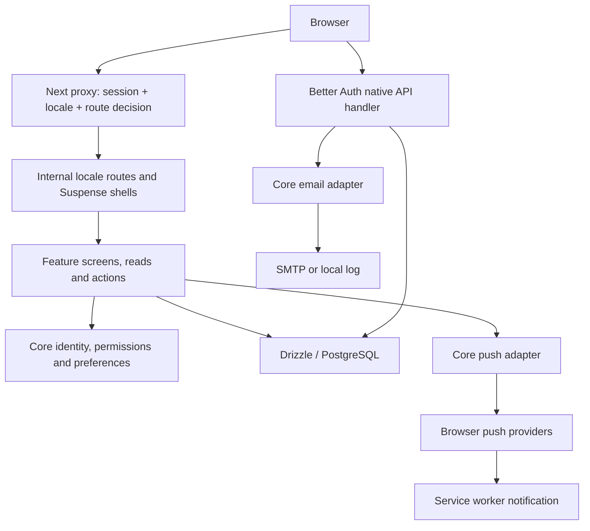

# Baseline, system map and verification ledger

[Review index](README.md). This is a dated source snapshot, not a certification or a deployed-state audit.

## Repository baseline

- Date: **2026-09-23**, Europe/Oslo.
- Commit: **`930a2a527b5f124e9a764b224f32994651a417b6`** (`feat: dm messages`). Branch: **`47-send-and-receive-a-message`**.
- Initial tracked tree was clean. Existing untracked files were `docs/reviews/README.md` and `docs/reviews/astra-codebase-review-prompt.md`; both were preserved.
- Read AGENTS, CONTRIBUTING, CONTEXT, structure guide, all three `docs/agents` files, all five ADRs, root README, existing review prompt/index and relevant module READMEs before consolidating judgments.
- No completed previous review existed. The prompt/README's product summary is stale: user-management, Posts, messaging and notifications are present on this branch. No assumption that the branch is merged or deployed was made. No issues/PRs/remotes were changed or fetched to claim implementation status elsewhere.
- Generated/ignored material already present includes `.next`, `next-env.d.ts`, `tsconfig.tsbuildinfo`, installed packages and `.env`. Actual environment contents were not needed or copied. Generated Next AGENTS guidance was retained. Migrations were neither inspected nor executed.
- A SHA-256 baseline of 366 tracked/existing-untracked files was captured outside the repo; final preservation results appear in the index. Review artifacts are the only authorized output exception to the read-only pass.

## Installed versions and checks

| Component | Installed |
| --- | --- |
| Next / React / React DOM | 16.3.5 / 19.3.0 / 19.3.0 |
| Better Auth / passkey / auth i18n | 1.7.4 / 1.7.4 / 1.7.4 |
| Better Auth CLI | 1.4.21 |
| Drizzle ORM / node-postgres | 0.45.2 / 8.22.0 |
| next-intl / Base UI | 4.14.4 / 1.8.0 |
| TanStack React Form / Next wrapper | 1.33.5 / 1.33.5 |
| Tailwind / TypeScript / Biome | 4.3.3 / 7.0.2 / 2.5.13 |
| Vitest / archunit | 4.1.11 / 2.5.4 |
| Bun / Node | 1.4.0 / 22.14.0 |

Package.json ranges are not the version evidence. Installed sources and the lockfile were inspected. `tst` runs **Bun**, despite some Vitest imports and the Vitest configuration. No test-runner migration is recommended on that fact alone.

## System map

`src/app` owns route topology. `src/features/{account,user-management,posts,messaging,notification-broadcast}` own product workflows. `src/core` owns auth/config/DB/email/i18n/preferences/navigation/logging/push. `src/shared` contains generic roles/validation/helpers/layouts and Base UI primitives. A static import graph found no cycle or core/shared reverse dependency among 254 non-test TS/TSX modules; this bounded check is not an exhaustive dynamic-dependency analysis.

Feature public entrypoints are already used by routes, and messaging has an effective deeper `sending` seam. Do not flatten the feature tree or replace it with repository/controller/service layers. User-management persistence/policy remains less local than messaging; target that difference when addressing its findings.

## Route topology

Public URLs have no locale prefix. The proxy selects a cookie/saved preference and rewrites to `[locale]`; locales are en/sv/de. Supported root variants are generated statically. Root layout composes theme, translation provider and toast host.

| Public path | Current purpose / boundary |
| --- | --- |
| `/login`, `/forgot-password`, `/reset-password`, `/two-factor`, `/activation-failed` | Public auth workflows; signed-in redirects except valid reset-token workflow |
| `/activate` | Authenticated session from an activation magic link; sets first password |
| `/`, `/me`, `/me/settings` | Authenticated home/profile/account settings |
| `/news`, `/news/[id]` | Shared published Posts; every User sees the same feed |
| `/news/new` | Publish; global Post-create gate + server action check |
| `/messages`, `/messages/new`, `/messages/[conversationId]` | Direct Conversations; route denies impersonation, module gap in AUTHZ-002 |
| `/admin`, `/admin/users`, `/admin/notifications` | Admin surface, Invite/import/lifecycle and manual push broadcast |
| `/api/auth/[...all]` | Native Better Auth GET/POST routes; outside proxy matcher and independent of app actions |
| Manifest/icons/service worker | Framework/static assets; service worker has no authenticated-content offline cache |

## Representative workflows and schema ownership

| Flow | Trace / retained good behavior |
| --- | --- |
| Email/username login | Login form → service → native password endpoint → challenge or session → return destination. 2FA is represented in login result; redirect normalization has WEB-001. |
| Invite/import/activation | Authorized action → at most 50 validated rows, concurrency five → native User creation → magic-link email → verification/session → setPassword. Creation and dispatch failure are separate outcomes, appropriate because Invite creates the User immediately. |
| Reset | Public request → email callback → token reset → sessions revoked → sign-in. Completion/challenge semantics need AUTH-005; token destination needs AUTH-002. |
| Account security | Native credential APIs, passkey management, TOTP/email OTP/backup codes and session controls. Ownership/cryptographic mechanics are delegated to Better Auth; impersonation/alternate entrypoint policy is app responsibility. |
| User lifecycle | App input validation → cached requireAdmin → target/count reads → native setter → revalidate. Native alternative routes and non-atomic invariant require AUTHZ-001. |
| Post | Published-only, shaped query → escaped plain text; publish validates, authorizes, inserts, invalidates and redirects outside catch. No invented rich-text/draft requirement. |
| Direct Message | Derived sender → membership/active counterpart → transaction → sender/key lock, Conversation sequence allocation, insert + sender cursor → invalidation. Pair lock/unique pair prevents duplicate Conversations. ADR 0005's exact-intent retry rule is implemented. |
| Conversation read | Membership-scoped bounded 50-message window + sentinel; signed read token → monotonically advance cursor. Inbox uses screen-shaped lateral latest/unread queries. |
| Preferences | Runtime-validating JSONB contract, safe defaults, atomic partial upsert preserving other fields; browser locale overrides saved User default. |
| Push | Browser service-worker subscription → authenticated storage → selected/all/self-test delivery → provider acceptance + status bookkeeping. Trust, audience, browser binding and outcome gaps are NOTIFY-01–04. |

Schema ownership is split into `auth.ts`, `messaging.ts`, `posts.ts`, `notifications.ts`, and `user-preferences.ts` under `core/db/schema`. Auth fields are provider-owned, including intentional `banned` storage for Inactive User (ADR 0003). Application code should translate that vocabulary at its boundary; adding a second activity flag would create two authorities. No rename/multi-tenant schema redesign is recommended. Messaging constraints, unique indexes and transaction ordering are meaningful safeguards. Live schema/migration equivalence was not checked.

## Documentation hierarchy

| Document | Authority / intended ownership |
| --- | --- |
| User review contract | Scope/exclusions and this pass's output authorization |
| AGENTS + linked agent docs | Work instructions, tracker operations, structural pointers |
| CONTRIBUTING | Team ADR acceptance and contribution process |
| CONTEXT | Product vocabulary and domain rules |
| ADR 0001–0005 | Flat membership, inactivity, ban-field mapping, locale overrides, Message idempotency decisions |
| docs/codebase-structure | Code ownership and dependency conventions |
| Module READMEs | i18n/preferences/notifications/messaging interfaces and local invariants |
| Root README | Setup and entry map; currently stale, DOC-001 |
| This dated review | Evidence and proposals only; does not supersede an ADR |

Keep proposed access-control decisions here/on their introducing branch and PR until team agreement. No issue/ADR publication was performed. A merged ADR means team discussion; this review does not establish that approval.

## Verification performed

Checks ran in `/tmp/csk-hub-review-2026-09-23`, copied from tracked files without migration content or real `.env`. Dependencies were initially symlinked for checks and later cloned for the default Turbopack build. Auth-dependent checks received fresh synthetic secrets/keys, fake email mode and a non-service localhost database port. No application database, real email or push endpoint was used.

| Check | Result / interpretation |
| --- | --- |
| `tsc --noEmit --incremental false` | **Pass**. Existing generated `next-env.d.ts` was copied; this is not fresh build/type generation proof. |
| `biome check` | **Pass**, 308 files, no fixes. Markdown/migrations excluded by config. |
| `bun test ./src ./messages.test.ts --dots` | **Pass**, 140 tests / 34 files / 265 assertions, 4.07 seconds. Auth adapters mocked by suite as written. |
| Full `bun test --dots` | **Not green**. Initial env-free run exited validation; synthetic-env run reported `Architecture Rules > core should not depend on app` timeout (5-second test budget, reported ~37 seconds). No complete successful summary. No code violation inferred from timeout. |
| Static source import/direction/cycle check | **Pass in bounded model**: 254 non-test modules, no cycles or forbidden core/shared edges. Regex/path resolution omits dynamic behavior; does not replace archunit pass. |
| Default `next build` | **Incomplete**. Started Next 16.3.5/Turbopack with Cache Components and Partial Prefetching; remained at compilation and was terminated at 180 seconds. No diagnosed app compilation failure or successful build claim. No repeated speculative build tuning. |
| Better Auth memory-handler probes | **Confirmed**: unknown-email OTP registration; email-only session for 2FA User; arbitrary Vercel reset callback carrying token; cookie-authentication after DB session removal; impersonated registration challenge. Adapted config omitted Drizzle, Next cookie adapter, username, i18n and custom role grants. |
| Push destination probe | **Confirmed transport destination control**, fake HTTPS request only; no real connection. Scheme/port/TLS limitations in NOTIFY-01. |
| Env probes | **Confirmed** ENVIRONMENT production mismatch and sample blank-value validation failures. No actual secrets output. |
| PostgreSQL SSL parsing | **Confirmed** requested verify-full becomes rejectUnauthorized false through current rewrite. No DB connection. |
| ICU/catalog validation | **Pass**, 382 leaves per locale, identical keys, valid ICU and matching argument/type sets. Existing permanent guard checks keys only. |
| Return destination / form API probes | **Confirmed** control-character URL normalization mismatch; installed FormApi accepted duplicate pending submissions. UI browser manifestation inferred from source. |
| Source preservation | All original manifest files rehashed at completion; see index. Only dated review artifacts added. |

Temporary raw logs/probes are convenient session evidence, not required continuation inputs. The findings and results above preserve the durable reasoning. A future implementation agent should write focused regression guards in the relevant change; this review did not add application tests.

## Inspected and acceptable ledger

- **Architecture:** feature entrypoints, shared/core direction and workflow-local organization are coherent. No evidence justifying a broad directory rewrite. Existing public-entrypoint regex guard has limited import-syntax reach; not elevated absent a demonstrated violating edge.
- **Next/React:** installed root-params, authentication-with-Cache-Components, data-security and error-handling docs consulted. Thin route composition, explicit Suspense around request work, async headers APIs and universal/server/client i18n separation fit the installed version. No private-data `use cache` leak found in inspected routes. No proposal to disable advanced rendering flags merely because they are advanced.
- **Auth mechanics:** password hashing, TOTP/backup-code/passkey cryptography and target ownership remain library responsibilities. Server setPassword, reset token lifecycle and reset session-revocation option are used. Native Admin middleware is authoritative. `testUtils` has no public endpoints in this version. Remaining defects are enumerated rather than alleging every endpoint unsafe.
- **User management:** server input validation, duplicate-email result, CSV cap/preview, bounded Invite concurrency and partial email failure reporting fit the domain. A pre-existing inactive email remains reserved by decision. No retry queue/outbox project is justified by this review.
- **Data:** parameterized Drizzle expressions, shaped projections, split schemas, relationship constraints, messaging transaction/idempotency boundary and atomic preferences upsert inspected. No actionable rewrite found beyond the cited policy/TLS/notification boundaries. Schema migrations and Erasure behavior excluded.
- **UI/a11y:** representative labels/autocomplete/aria-invalid/role-alert, dialog title/description, table overflow, wrapping navigation and responsive widths inspected. Base UI primitives retained. Local destructive color overrides in user actions and a few explicit icon colors were seen; no measured contrast/behavior defect established, so no broad token rewrite proposed. Link field errors/descriptions with aria-describedby when fixing those forms; not counted as a separate severe finding.
- **I18n:** single locale definition, request/response cookie initialization, browser override semantics, typed translation keys and current catalog parity are sound. Used fallback/error/primitive copy has I18N-001. No translation wording criticism.
- **Adapters/ops:** SMTP requires STARTTLS; sends have explicit failure results. Structured logger is best effort. Basic anti-framing/content-type/referrer headers exist. Service worker opens the app origin and does not persist private pages offline. Deployment headers/cookies were not measured; no generic CSP/HSTS deficit declared without hosting evidence.
- **Dependencies/dead material:** no source dependency cycles found. `date-fns`, indirect form/formatter imports and generator version skew recorded in TOOL-001. Unused generated primitives and their dependencies are not automatically dead product code. `LOG_DATABASE` is declared but unused; harmless stale config can be removed with OPS-002, not a standalone priority. Home/admin placeholder elements are scaffolding, not missing future-feature defects.
- **Documentation:** module-local docs are useful and mostly scoped well. Root status/setup/route map is stale. No document-size-only defect found; add navigation before splitting ownership.

## Limits

No live PostgreSQL catalog/concurrency test, deployed inspection, authenticated browser flow, actual WebAuthn ceremony, SMTP delivery, push/service-worker lifecycle, mobile screenshot/keyboard/screen-reader pass, or performance benchmark. No successful full build/architecture suite. No broad dependency vulnerability scan, formal security/accessibility certification or exhaustive native endpoint catalog. The user explicitly excluded migrations, Erasure, rate-limit design, durable business audit, translation wording and future product design. These are not silently reported as reviewed.
