## Events scheme (v2)

> Self-contained spec. Builds on [[Groups - DB Scheme]] (v3). Target: Postgres (15+).
> Every constraint is tagged with where it is enforced: **[DB]** index/FK/CHECK, **[trigger]**, or **[app]**.

### Terminology

| Term                      | Meaning                                                                                                                                                                        | In the schema                                        |
| ------------------------- | ------------------------------------------------------------------------------------------------------------------------------------------------------------------------------ | ---------------------------------------------------- |
| **Event**                 | A dated entry in the CSK calendar: anything the choirs could reasonably put in a calendar. Never a group of people and never a message.                                        | `Events`                                             |
| **Event type**            | A fixed kind of event (Rehearsal, Gig, Concert, Social, Rephelg, Körmöte, Booking, Meeting, Other). Code branches on it. Types with extra data have an extension table.        | `EventType` enum, extension tables                   |
| **Series**                | A named grouping of recurring occurrences ("KK rehearsals, autumn 2026"). Each occurrence is its own Event.                                                                    | `EventSeries`                                        |
| **Organiser group**       | The group responsible for an event (Gigmästeri, Sexmästeri, a choir). Drives who may edit it. Not the audience.                                                                | `Events.organiserGroupId`                            |
| **Target**                | One rule for who an event is for: a group, a voice family, or both. Same idea as `NewsTargets`.                                                                                | `EventTargets`                                       |
| **Audience**              | The Users an event is for. Always computed from the targets plus dated memberships as of the event's date, never stored. No targets means everyone in CSK.                     | derived                                              |
| **Participation mode**    | What the event collects from its audience in advance: nothing, a Response, or a Registration. Also decides whether attendance is expected.                                     | `ParticipationMode` enum, `Events.participationMode` |
| **Response**              | A singer's answer in advance: Yes, No or Maybe. Also called RSVP in the UI. Only in the two response modes.                                                                    | `EventResponses`                                     |
| **Absence reason**        | Why a singer declines an event in `ResponseRequiredStrict` mode: a preset from a global list, or custom text.                                                                  | `AbsenceReasons`, `EventResponses.reasonText`        |
| **Registration**          | A User signing up for an event in `Registration` mode, possibly answering the event's registration questions. No registration means "not signed up", never a No or an absence. | `EventRegistrations`                                 |
| **Registration question** | Something the organiser asks registrants (meal choice, dietary requirements). Belongs to one event.                                                                            | `EventRegistrationQuestions`                         |
| **Event detail**          | An organiser-provided labelled value describing the event ("Dress code: Kavaj", "Bring: Music folder"). Information _to_ the audience, not _from_ it.                          | `EventDetails`                                       |
| **Attendance**            | What actually happened: Present, Excused or Absent. Recorded afterwards, independent of the response or registration.                                                          | `EventAttendance`                                    |

Reserved words: **Post** stays reserved for news, **Position** for organisational positions, and **Invite** for an Admin bringing an email address into the Hub (see CONTEXT.md). Events therefore have an **audience** and **responses**, never "invitees". **Registration** here always means signing up for an event, never joining the Hub (that is an Invite).

Domain facts:

- An event covers anything that could go in the choirs' calendar, including rehearsals, gigs, own concerts, social events, rephelg, körmöten, room bookings and general meetings.
- Events are **flat**: no parent/child, no nested events.
- An event has **one audience**. There is no separate "can see" versus "expected to attend".
- Times are stored as `timestamptz` and shown in Europe/Stockholm.
- A gig's gig group is just a target. The planning group (Gigmästeri) is the organiser group.
- A **Körmöte** is its own domain concept. **Meeting** covers other meetings (board, committees) and does not replace it.
- A **Booking** is a room reservation: an event with a `locationId` that normally collects nothing (`participationMode = None`).

### Schema

```ER Scheme
Users(_id_, ...)
Groups(_id_, ...)               // see Groups - DB Scheme (v3)

Enum EventType:
	Rehearsal
	Gig
	Concert
	Social
	Rephelg
	Körmöte
	Booking         // reserving a room
	Meeting         // board, committee and other general meetings
	Other
	// Rehearsal, Gig and Social have an extension table. The others have none.

Enum EventStatus:
	Draft
	Published
	Cancelled

// Native enum, not a table: the code branches on every value.
Enum ParticipationMode:
	None                    // nothing is collected
	ResponseRequired        // audience must respond Yes / No / Maybe; attendance optional
	ResponseRequiredStrict  // audience must respond Yes / No and is expected to attend; No needs a reason
	Registration            // whoever wants to attend registers; the audience is not expected to attend

Enum RsvpAnswer:                Yes, No, Maybe
Enum AttendanceStatus:          Present, Excused, Absent
Enum RegistrationStatus:        Registered, Withdrawn
Enum RegistrationQuestionKind:  Text, SingleChoice, MultipleChoice, Checkbox

// Reusable venues. An event may also carry free text instead of or on top of a venue.
Locations(_id_, name, address?, mapUrl?, active)
	active default true                    // archive instead of delete

	[DB] UNIQUE (name) WHERE active

// Named grouping of recurring occurrences. The app creates and schedules the occurrences.
EventSeries(_id_, name, createdAt)
	name               // e.g. "KK rehearsals, autumn 2026"

Events(_id_, type, status, title, description?, startsAt, endsAt, allDay,
       locationId?, locationText?, callTime?, respondBy?, participationMode,
       organiserGroupId?, seriesId?, createdBy?, createdAt)
	type               -> EventType
	status             -> EventStatus      // default Draft
	description        : jsonb             // rich-text editor document (Events' own document schema); NULL when empty
	allDay             default false
	locationId         -> Locations.id
	locationText       // detail ("room 3") or a one-off place; shown instead of the venue when set
	callTime           // arrival time at or before startsAt (gigs, concerts, anything)
	respondBy          // deadline for responses or registrations, whichever the mode collects
	participationMode  -> ParticipationMode  // default set by type
	organiserGroupId   -> Groups.id        // who is responsible; not the audience
	seriesId           -> EventSeries.id
	createdBy          -> Users.id         // ON DELETE SET NULL (Erasure)

	[DB] CHECK (endsAt > startsAt)
	[DB] CHECK (callTime IS NULL OR callTime <= startsAt)
	[DB] CHECK (respondBy IS NULL OR respondBy <= startsAt)
	[DB] CHECK (participationMode <> 'None' OR respondBy IS NULL)   // nothing to respond to
	[DB] UNIQUE (id, type)                 // lets the extension tables pin their type (see below)

// Practical information shown on the event, in order. Replaces a dedicated dressCode column.
EventDetails(_id_, eventId, label, value, sortOrder)
	eventId    -> Events.id                // ON DELETE CASCADE
	label      // "Dress code", "Bring", "Entrance"
	value      // "Kavaj", "Music folder and water", "Use the courtyard door"

// --- Extension tables: 1:1 with Events, like Choirs/Sections extend Groups ---

Rehearsals(_eventId_, leaderUserId?)
	leaderUserId -> Users.id               // who leads it if not the usual conductor; needn't be a member. ON DELETE SET NULL

Gigs(_eventId_, responsibleUserId?, contactName?, contactDetails?)
	responsibleUserId -> Users.id          // CSK's appointed contact for this gig. ON DELETE SET NULL
	// contactName / contactDetails: the booking contact or client: an external person, not a User

SocialEvents(_eventId_, costInfo?)
	// free text, e.g. "200 kr incl. food, 150 kr for new members". Prices vary between members, so no amount column.

// --- Audience ---

// One row = one rule. Several rows are OR'ed. Inside a row, group and voice family are AND'ed.
// No rows at all = everyone in CSK.
EventTargets(_id_, eventId, groupId?, voiceFamily?)
	eventId     -> Events.id
	groupId     -> Groups.id
	voiceFamily : voice_family             // domain from Groups v3

	[DB] CHECK (groupId IS NOT NULL OR voiceFamily IS NOT NULL)
	[DB] UNIQUE (eventId, groupId, voiceFamily) NULLS NOT DISTINCT

// --- Responses (RSVP): ResponseRequired and ResponseRequiredStrict ---

// Global, Admin-managed list of preset reasons ("Sick", "Exam", "Work", "Travelling").
AbsenceReasons(_id_, label, active)
	active default true                    // archive instead of delete, history stays intact

	[DB] UNIQUE (label) WHERE active

// A singer's answer. No row = no response yet.
// Surrogate key so that rows can outlive their User (Erasure).
EventResponses(_id_, eventId, userId?, answer, comment?, absenceReasonId?, reasonText?, respondedAt)
	eventId         -> Events.id
	userId          -> Users.id            // ON DELETE SET NULL
	answer          -> RsvpAnswer
	comment         // optional note on any answer
	absenceReasonId -> AbsenceReasons.id   // preset reason
	reasonText      // custom reason
	respondedAt     // time of the latest change; late = respondedAt > Events.respondBy

	[DB] UNIQUE (eventId, userId)          // NULL userIds (erased) do not collide
	[DB] CHECK (absenceReasonId IS NULL OR reasonText IS NULL)           // one reason, not both
	[DB] CHECK (answer = 'No' OR (absenceReasonId IS NULL AND reasonText IS NULL))   // reasons only go with No

// --- Registrations: Registration mode ---

// What the organiser asks registrants. Per event, in order.
EventRegistrationQuestions(_id_, eventId, label, kind, required, sortOrder)
	eventId    -> Events.id                // ON DELETE CASCADE
	kind       -> RegistrationQuestionKind
	required   default false

// The choices of a SingleChoice or MultipleChoice question.
EventRegistrationQuestionOptions(_id_, questionId, label, sortOrder)
	questionId -> EventRegistrationQuestions.id   // ON DELETE CASCADE

	[DB] UNIQUE (questionId, id)           // target of the composite FK below

// A User signing up. No row = not signed up. Withdrawing keeps the row.
// Surrogate key so that rows can outlive their User (Erasure).
EventRegistrations(_id_, eventId, userId?, status, comment?, registeredAt, withdrawnAt?)
	eventId      -> Events.id
	userId       -> Users.id               // ON DELETE SET NULL
	status       -> RegistrationStatus     // default Registered
	comment      // optional note to the organiser
	registeredAt // time of the latest (re-)registration; late = registeredAt > Events.respondBy
	withdrawnAt  // set while Withdrawn

	[DB] UNIQUE (eventId, userId)          // NULL userIds (erased) do not collide
	[DB] CHECK ((status = 'Withdrawn') = (withdrawnAt IS NOT NULL))

// One row per answered question. Text and Checkbox answers carry their value here;
// choice answers carry their chosen options in EventRegistrationAnswerChoices.
EventRegistrationAnswers(_registrationId_, _questionId_, text?, checked?)
	registrationId -> EventRegistrations.id         // ON DELETE CASCADE
	questionId     -> EventRegistrationQuestions.id // ON DELETE RESTRICT

	[DB] CHECK (text IS NULL OR checked IS NULL)

EventRegistrationAnswerChoices(_registrationId_, _questionId_, _optionId_)
	(registrationId, questionId) -> EventRegistrationAnswers   // ON DELETE CASCADE
	(questionId, optionId)       -> EventRegistrationQuestionOptions(questionId, id)   // option belongs to the question. ON DELETE RESTRICT

// --- Attendance (what actually happened) ---

EventAttendance(_id_, eventId, userId?, status, recordedBy?, recordedAt)
	eventId    -> Events.id
	userId     -> Users.id                 // ON DELETE SET NULL
	status     -> AttendanceStatus
	recordedBy -> Users.id                 // ON DELETE SET NULL
	recordedAt

	[DB] UNIQUE (eventId, userId)
```

### Constraints and rules

**Events**

- [app] **allDay**: `startsAt` is 00:00 on the first day and `endsAt` is 00:00 on the day after the last day, in Europe/Stockholm.
- [app] **Lifecycle**: Draft → Published → Cancelled, and a cancelled event may be reinstated (Published). A Published event never goes back to Draft.
- [app] A Draft is visible only to those who may edit it. Only Drafts may be deleted; a Published event is cancelled, never deleted, so responses, registrations and attendance survive. A Cancelled event stays visible (struck through).
- [app] The UI shows `locationText` when set, otherwise the Location's name and address.
- [app] `organiserGroupId` refers to an active group.
- [app] **Description** is parsed through the Events document schema (`createDocumentSchema` from the rich-text module) before it is stored, never stored as sent. Events define their own allowed features (emphasis, lists, links to start with) and do not reuse the Posts schema. A document with nothing to read is stored as NULL. See `src/features/rich-text/README.md` and `docs/adr/0005-post-content-is-stored-as-the-editor-document.md`.
- [app] Rehearsal focus, a concert programme and external ticket information go in the description.
- [app] **Event details** are shown in `sortOrder`. Anything the app needs to interpret (dates, participation, location) keeps a dedicated column and is never an event detail.

**Participation mode**

- [app] Default by type, overridable per event by the organiser:

  | Type                    | Default mode             |
  | ----------------------- | ------------------------ |
  | Rehearsal, Concert      | `ResponseRequiredStrict` |
  | Gig, Körmöte            | `ResponseRequired`       |
  | Social, Rephelg         | `Registration`           |
  | Booking, Meeting, Other | `None`                   |

- [trigger/app] `EventResponses` rows exist only for events in `ResponseRequired` or `ResponseRequiredStrict`. `EventRegistrations` rows (and registration questions) exist only for events in `Registration`.
- [app] Switching between `ResponseRequired` and `ResponseRequiredStrict` does not rewrite existing responses. Switching to or from `None` or `Registration` is rejected once the event has responses or registrations.

**Extension tables**

- [trigger/app] A `Rehearsals` row exists iff `Events.type = Rehearsal`; same for `Gigs`/Gig and `SocialEvents`/Social. Concert, Rephelg, Körmöte, Booking, Meeting and Other have no extension row.
- [DB, optional hardening] Each extension table carries a constant `type` column with a CHECK (e.g. `type = 'Rehearsal'`) and a composite FK `(eventId, type) -> Events(id, type)`, so a row cannot be attached to an event of the wrong type.
- [app] Gig contact details are personal data about a non-User. Clear them when no longer needed (retention rule not decided).
- [app] `Gigs.responsibleUserId` is the person CSK appointed for that gig. It is set explicitly, never inferred from `createdBy` or from who holds a Position. It is not required to publish.

**Rehearsal kind (derived, never stored)**

How the UI labels a rehearsal, from its targets and series membership:

```
choirOnly(e)    = e has exactly one target t, t.groupId is a Choir and t.voiceFamily IS NULL
sectional(e)    = e has at least one target, and every target t has
                  t.groupId is a Section OR t.voiceFamily IS NOT NULL

kind(e):
	choirOnly(e) AND e.seriesId IS NOT NULL -> "Choir rehearsal"
	choirOnly(e) AND e.seriesId IS NULL     -> "Extra rehearsal"
	sectional(e)                            -> "Sectional rehearsal"
	otherwise                               -> "Rehearsal"   // no targets, several choirs, gig groups, mixed shapes
```

**Targets and audience**

- [app] Several targets are OR'ed; within one target, group and voice family are AND'ed.
- [app] **No targets = everyone**: Users with a Choir membership on the event's date (see pseudo-code below).
- [app] Targets, event details and registration questions are copied per occurrence when a series is created or edited.
- [app] Typical shapes: a choir (`groupId = KK`), a section (`groupId = KKB`), all basses in CSK (`voiceFamily = B`), KK basses (`groupId = KK, voiceFamily = B`), a gig group (`groupId = <gig group>`).

Audience (computed, never stored):

```
d = date of Events.startsAt in Europe/Stockholm
active(m, d) = m.startDate <= d AND (m.endDate IS NULL OR m.endDate >= d)

inAudience(user, event):
	if the event has no EventTargets:
		return user has an active(., d) GroupMembers row in any group with type = Choir
	return any target t of the event satisfies matches(t, user, d)

matches(t, user, d):
	groupOk = t.groupId IS NULL
	          OR user has an active(., d) GroupMembers row in t.groupId
	voiceOk = t.voiceFamily IS NULL
	          OR user has an active(., d) Section membership m
	             with familyOf(m.voice) = t.voiceFamily and m.groupId in scope(t.groupId)
	return groupOk AND voiceOk

scope(g):  g IS NULL                          -> all sections
           g is a Choir                       -> sections with choirId = g
           g is a Section                     -> g itself
           otherwise (gig group, committee..) -> all sections
```

**Series**

- [app] Occurrences of one series share the same `type`.
- [app] Each occurrence has its own responses, registrations, attendance, status and edits.
- [app] "Edit all following" is done by the app at edit time: it copies the change onto the chosen occurrences. The series stores no template.

**Responses**

- [trigger/app] Only audience members respond, and only to Published events in a response mode.
- [trigger/app] In `ResponseRequiredStrict`: `answer <> Maybe`, and `answer = No` needs exactly one of `absenceReasonId` / `reasonText`.
- [app] In `ResponseRequired`: any answer; a reason with No is optional.
- [app] Only active `AbsenceReasons` can be selected. Archived ones stay on old rows.
- [app] A response after `respondBy` is accepted but flagged late (`respondedAt > respondBy`). It is not blocked.
- [app] **Visibility**: the answer itself is visible to the audience. `comment`, `absenceReasonId` and `reasonText` are visible only to the singer and to those who may edit the event.
- [app] A response is kept when the singer later leaves (Inactive User).

**Registrations**

- [trigger/app] Only audience members register, and only to Published events in `Registration` mode.
- [trigger/app] An answer's question belongs to the registration's event.
- [app] Answers must fit the question's kind: Text → `text`; Checkbox → `checked`; SingleChoice → exactly one choice row; MultipleChoice → one or more choice rows.
- [app] Registering requires an answer to every `required` question. A question made required later is not enforced on existing registrations.
- [app] **Withdrawing** sets `status = Withdrawn` and `withdrawnAt`; the answers stay. Registering again sets `status = Registered`, clears `withdrawnAt` and updates `registeredAt`.
- [app] Once an event has registrations, its questions and options can be added and relabelled but not deleted (`ON DELETE RESTRICT`).
- [app] A registration after `respondBy` is accepted but flagged late (`registeredAt > respondBy`). It is not blocked.
- [app] **Visibility**: who is registered is visible to the audience. `comment` and the answers are visible only to the registrant and to those who may edit the event.
- [app] Registration answers can be sensitive (dietary requirements, allergies). Clear them when no longer needed (retention rule not decided).

**Attendance**

- [app] **No row = not recorded**. It never means Absent.
- [app] Rows are recorded for audience members of Published events. A Cancelled event gets no attendance.
- [app] **Who may record**: everyone who may edit the event, plus the **Stämförälder** of a section, for members of their own section only.
- [app] Independent of the response or registration: the organiser decides Present / Excused / Absent. The UI may show the reason while recording, but nothing is set automatically.

**Permissions (app rules, no permission tables)**

- [app] **Admin** may do everything.
- [app] A **position holder in the organiser group** may edit that event.
- [app] A **position on a choir** (Conductor, Notfiskal, Konsertmästare) gives rights over events organised by that choir or any group with that `choirId`, and over events whose targets all lie within that choir (consistent with the groups spec).
- [app] **Gigs** are created by position holders in the Gigmästeri group (which becomes the organiser group), or by Admins.
- [app] Editing includes creating, changing, cancelling, managing targets, event details and registration questions, and recording attendance.
- [app] Draft events are visible only to those who may edit.

**Inactive Users and Erasure**

- [app] An Inactive User's responses, registrations and attendance are kept untouched (historical participation).
- [DB] On **Erasure**, `ON DELETE SET NULL` clears `userId` in `EventResponses`, `EventRegistrations` and `EventAttendance`, and clears `createdBy`, `recordedBy`, `leaderUserId` and `responsibleUserId` wherever they point at the erased User.
- [trigger/app] On Erasure also wipe `comment` and `reasonText` on the erased User's responses, and `comment` and every `text` answer on their registrations. The preset `absenceReasonId`, Checkbox answers and choice answers stay, since they are not identifying once `userId` is gone.
- [app] Attendance totals for past events must be read from `EventAttendance`, not from the computed audience. Erasure also removes the User's memberships, so the computed audience of a past event shrinks.

### Examples

```
-- Weekly KK rehearsal: a series, one row per occurrence
EventSeries   (KK-rep-ht26, name = "KK rehearsals, autumn 2026")
Events        (KK rep 2026-10-07, type = Rehearsal, status = Published, 18:00-21:00,
               participationMode = ResponseRequiredStrict, organiserGroupId = KK, seriesId = KK-rep-ht26)
Rehearsals    (KK rep 2026-10-07)                        -- derived kind: Choir rehearsal
EventTargets  (KK rep 2026-10-07, groupId = KK)
Events        (KK rep 2026-10-14, ... same series)     -- own row, own responses and attendance

AbsenceReasons(Sick) (Exam) (Work) (Travelling)

-- Responses to the 7 Oct rehearsal
EventResponses(KK rep 2026-10-07, Lucas, answer = No,  absenceReasonId = Exam)
EventResponses(KK rep 2026-10-07, Olof,  answer = Yes)
EventResponses(KK rep 2026-10-07, Maja,  answer = No,  reasonText = "Moving apartment")
-- answer = Maybe would be rejected: ResponseRequiredStrict
-- answer = No with no reason would be rejected
-- answer = No with both absenceReasonId and reasonText would be rejected (DB CHECK)

-- Attendance afterwards
EventAttendance(KK rep 2026-10-07, Lucas, Excused, recordedBy = Olof)   -- Olof is Stämförälder of KKB, Lucas is in KKB
EventAttendance(KK rep 2026-10-07, Olof,  Present, recordedBy = Sara)   -- Sara is Notfiskal in KK
EventAttendance(KK rep 2026-10-07, Maja,  Excused, recordedBy = Sara)
```

```
-- A gig. The gig group is simply the target; Gigmästeri organises; Olof is CSK's contact.
Events        (Alumnikväll, type = Gig, status = Published, startsAt = 2026-11-14 17:00,
               callTime = 2026-11-14 15:30,
               participationMode = ResponseRequired, organiserGroupId = Gigmästeri)
EventDetails  (Alumnikväll, label = "Dress code", value = "Kavaj",                 sortOrder = 1)
EventDetails  (Alumnikväll, label = "Bring",      value = "Music folder and water", sortOrder = 2)
Gigs          (Alumnikväll, responsibleUserId = Olof, contactName = "Eva Berg", contactDetails = "...")
EventTargets  (Alumnikväll, groupId = <gig group "Alumnikväll">)
EventResponses(Alumnikväll, Lucas, answer = Maybe)       -- allowed: ResponseRequired
```

```
-- A social event with registration
Events        (Höstsittning, type = Social, status = Published, respondBy = 2026-11-01 23:59,
               participationMode = Registration, organiserGroupId = Sexmästeri)
SocialEvents  (Höstsittning, costInfo = "200 kr incl. food, 150 kr for new members")
EventRegistrationQuestions      (Q1, Höstsittning, label = "Main course", kind = SingleChoice, required = true)
EventRegistrationQuestionOptions(O1, Q1, "Meat") (O2, Q1, "Vegetarian")
EventRegistrationQuestions      (Q2, Höstsittning, label = "Allergies",   kind = Text,         required = false)
EventRegistrationQuestions      (Q3, Höstsittning, label = "Alcohol-free drinks", kind = Checkbox, required = false)

EventRegistrations            (R1, Höstsittning, Lucas, Registered, registeredAt = 2026-10-20)
EventRegistrationAnswers      (R1, Q1)
EventRegistrationAnswerChoices(R1, Q1, O2)                 -- Vegetarian
EventRegistrationAnswers      (R1, Q2, text = "Nuts")
EventRegistrationAnswers      (R1, Q3, checked = true)

EventRegistrations(R2, Höstsittning, Maja, Withdrawn, registeredAt = 2026-10-21, withdrawnAt = 2026-10-30)
-- Olof has no row: not signed up. That is not a No and not an absence.
-- An EventResponses row for Höstsittning would be rejected: Registration mode
```

```
-- A sectional rehearsal for the KK basses, led by Olof
Events        (KKB stämrep, type = Rehearsal, ..., organiserGroupId = KKB)
Rehearsals    (KKB stämrep, leaderUserId = Olof)          -- derived kind: Sectional rehearsal
EventTargets  (KKB stämrep, groupId = KKB)               -- or: groupId = KK, voiceFamily = B

-- A choir meeting for everyone: no targets
Events        (Körmöte, type = Körmöte, participationMode = ResponseRequired)

-- A room booking
Events        (Board room, type = Booking, locationId = <Rehearsal room>, participationMode = None, organiserGroupId = Board)

-- All basses in CSK: no group, only a voice family
EventTargets  (Bass-spex, voiceFamily = B)               -- MKB1, MKB2 and KKB members, deduplicated
```

```
-- Erasure of Lucas
EventResponses    (KK rep 2026-10-07, userId = NULL, answer = No, absenceReasonId = Exam, comment = NULL, reasonText = NULL)
EventRegistrations(R1, Höstsittning, userId = NULL, Registered, comment = NULL)
EventRegistrationAnswers(R1, Q2, text = NULL)             -- Q1 choice and Q3 checkbox stay
EventAttendance   (KK rep 2026-10-07, userId = NULL, Excused, recordedBy = Olof)
Events.createdBy / Rehearsals.leaderUserId / Gigs.responsibleUserId pointing at Lucas -> NULL
```

Common queries:

- A singer's calendar → Published events with `startsAt >= now` where `inAudience(user, event)`.
- Who has not responded → `audience(event)` minus users in `EventResponses` (response modes only).
- Who declined and why (editors only) → `EventResponses` with `answer = No`, joined to `AbsenceReasons`.
- Late responders / registrants → `respondedAt > respondBy` / `registeredAt > respondBy`.
- Who is coming to a social → `EventRegistrations` with `status = Registered`.
- Catering counts → `EventRegistrationAnswerChoices` of Registered registrations, grouped by option.
- Rehearsal attendance over a term → count `EventAttendance` by status for events of type Rehearsal and a series.
- All occurrences of a recurring rehearsal → `Events WHERE seriesId = ...`.

### Out of scope here

- Cancellation reason, attachments or links on events, change history of edits, reminders and notification settings.
- A calendar feed (iCal) and any public or external calendar.
- Repertoire link on rehearsals and concerts (repertoire is not designed yet), capacity limits and waiting lists.
- Structured prices and currencies: cost is free text (`costInfo`) because prices vary between members.
- Overlap checks for Bookings. Rejecting two bookings of the same room, and marking which Locations are bookable rooms, can be added later.
- Extension tables for Concert, Rephelg, Körmöte, Booking, Meeting and Other. Add them later if those types need their own fields.

### Defaults I assumed (review these)

1. **"Everyone"** (no targets) means Users with a Choir membership on the event's date. A User with no choir membership (e.g. an Admin who does not sing) is not in the audience, but can still see everything they may edit.
2. **Late responses and registrations** are flagged, not blocked.
3. **Lifecycle**: Cancelled can be reinstated; Published can't go back to Draft.
4. **Edit rights**: any position on a choir counts (not just Conductor/Notfiskal), per the groups spec.
5. **Answer visibility**: the audience sees who answered what and who is registered; only comments, reasons and registration answers are restricted.
6. **Gig contact**: `responsibleUserId` is optional, also for publishing.
7. **Erasure** keeps the preset absence reason and choice/checkbox registration answers (anonymous) and wipes custom text and comments.

### ER diagram (v2)

```mermaid
erDiagram
    Users {
        int id PK
    }
    Groups {
        int id PK
    }
    Locations {
        int id PK
        string name "unique among active"
        string address
        string mapUrl
        bool active
    }
    EventSeries {
        int id PK
        string name
        timestamptz createdAt
    }
    Events {
        int id PK
        EventType type "Rehearsal, Gig, Concert, Social, Rephelg, Kormote, Booking, Meeting, Other"
        EventStatus status "Draft, Published, Cancelled"
        string title
        jsonb description "rich-text document"
        timestamptz startsAt
        timestamptz endsAt "after startsAt"
        bool allDay
        int locationId FK
        string locationText "detail or one-off place"
        timestamptz callTime "at or before startsAt"
        timestamptz respondBy "response or registration deadline"
        ParticipationMode participationMode "None, ResponseRequired, ResponseRequiredStrict, Registration"
        int organiserGroupId FK "who may edit, not the audience"
        int seriesId FK
        int createdBy FK "null after Erasure"
        timestamptz createdAt
    }
    EventDetails {
        int id PK
        int eventId FK
        string label
        string value
        int sortOrder
    }
    Rehearsals {
        int eventId PK, FK "type = Rehearsal"
        int leaderUserId FK "optional"
    }
    Gigs {
        int eventId PK, FK "type = Gig"
        int responsibleUserId FK "CSK contact, optional"
        string contactName
        string contactDetails
    }
    SocialEvents {
        int eventId PK, FK "type = Social"
        string costInfo
    }
    EventTargets {
        int id PK
        int eventId FK
        int groupId FK "optional"
        VoiceFamily voiceFamily "optional, group or family or both"
    }
    AbsenceReasons {
        int id PK
        string label "unique among active"
        bool active
    }
    EventResponses {
        int id PK
        int eventId FK
        int userId FK "null after Erasure"
        RsvpAnswer answer "Yes, No, Maybe"
        string comment "restricted visibility"
        int absenceReasonId FK "preset, only with No"
        string reasonText "custom, only with No"
        timestamptz respondedAt "latest change"
    }
    EventRegistrationQuestions {
        int id PK
        int eventId FK
        string label
        RegistrationQuestionKind kind "Text, SingleChoice, MultipleChoice, Checkbox"
        bool required
        int sortOrder
    }
    EventRegistrationQuestionOptions {
        int id PK
        int questionId FK
        string label
        int sortOrder
    }
    EventRegistrations {
        int id PK
        int eventId FK
        int userId FK "null after Erasure"
        RegistrationStatus status "Registered, Withdrawn"
        string comment "restricted visibility"
        timestamptz registeredAt "latest registration"
        timestamptz withdrawnAt "set iff Withdrawn"
    }
    EventRegistrationAnswers {
        int registrationId PK, FK
        int questionId PK, FK
        string text "Text questions"
        bool checked "Checkbox questions"
    }
    EventRegistrationAnswerChoices {
        int registrationId PK, FK
        int questionId PK, FK
        int optionId PK, FK "option of that question"
    }
    EventAttendance {
        int id PK
        int eventId FK
        int userId FK "null after Erasure"
        AttendanceStatus status "Present, Excused, Absent"
        int recordedBy FK
        timestamptz recordedAt
    }

    Events ||--o| Rehearsals : "is a"
    Events ||--o| Gigs : "is a"
    Events ||--o| SocialEvents : "is a"
    Events ||--o{ EventDetails : "described by"
    Locations |o--o{ Events : "held at"
    EventSeries |o--o{ Events : "groups"
    Groups |o--o{ Events : "organises"
    Users |o--o{ Events : "created"
    Users |o--o{ Rehearsals : "leads"
    Users |o--o{ Gigs : "responsible for"
    Events ||--o{ EventTargets : "targets"
    Groups |o--o{ EventTargets : "targeted by"
    Events ||--o{ EventResponses : "answered by"
    Users |o--o{ EventResponses : "answers"
    AbsenceReasons |o--o{ EventResponses : "preset reason"
    Events ||--o{ EventRegistrationQuestions : "asks"
    EventRegistrationQuestions ||--o{ EventRegistrationQuestionOptions : "offers"
    Events ||--o{ EventRegistrations : "registered for"
    Users |o--o{ EventRegistrations : "registers"
    EventRegistrations ||--o{ EventRegistrationAnswers : "answers"
    EventRegistrationQuestions ||--o{ EventRegistrationAnswers : "answered in"
    EventRegistrationAnswers ||--o{ EventRegistrationAnswerChoices : "chooses"
    EventRegistrationQuestionOptions ||--o{ EventRegistrationAnswerChoices : "chosen in"
    Events ||--o{ EventAttendance : "recorded for"
    Users |o--o{ EventAttendance : "attended"
    Users |o--o{ EventAttendance : "recorded"
```


