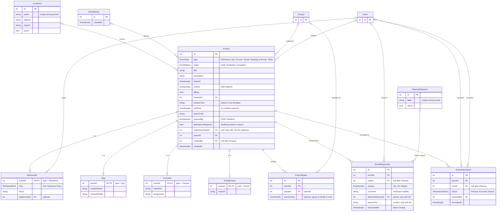

## Events scheme (v1)

> Self-contained spec. Builds on [[Groups - DB Scheme]] (v3). Target: Postgres (15+).
> Every constraint is tagged with where it is enforced: **[DB]** index/FK/CHECK, **[trigger]**, or **[app]**.

### Terminology

| Term               | Meaning                                                                                                                                                                | In the schema                                    |
| ------------------ | ---------------------------------------------------------------------------------------------------------------------------------------------------------------------- | ------------------------------------------------ |
| **Event**          | A dated entry in the CSK calendar: anything the choirs could reasonably put in a calendar. Never a group of people and never a message.                                | `Events`                                         |
| **Event type**     | A fixed kind of event (Rehearsal, Gig, Concert, Social, Rephelg, Körmöte, Other). Code branches on it. Types with extra data have an extension table.                   | `EventType` enum, extension tables               |
| **Series**         | A plain grouping of recurring occurrences (weekly rehearsals). Each occurrence is its own Event.                                                                       | `EventSeries`                                    |
| **Organiser group**| The group responsible for an event (Gigmästeri, Sexmästeri, a choir). Drives who may edit it. Not the audience.                                                        | `Events.organiserGroupId`                        |
| **Target**         | One rule for who an event is for: a group, a voice family, or both. Same idea as `NewsTargets`.                                                                        | `EventTargets`                                   |
| **Audience**       | The Users an event is for. Always computed from the targets plus dated memberships as of the event's date, never stored. No targets means everyone in CSK.              | derived                                          |
| **Response**       | A singer's answer in advance: Yes, No or Maybe. Also called RSVP in the UI.                                                                                            | `EventResponses`                                 |
| **Absence reason** | Why a singer declines an event that requires attendance: a preset from a global list, or custom text.                                                                  | `AbsenceReasons`, `EventResponses.reasonText`    |
| **Attendance**     | What actually happened: Present, Excused or Absent. Recorded afterwards, independent of the response.                                                                  | `EventAttendance`                                |

Reserved words: **Post** stays reserved for news, **Position** for organisational positions, and **Invite** for an Admin bringing an email address into the Hub (see CONTEXT.md). Events therefore have an **audience** and **responses**, never "invitees".

Domain facts:
- An event covers anything that could go in the choirs' calendar, including rehearsals, gigs, own concerts, social events, rephelg and körmöten.
- Events are **flat**: no parent/child, no nested events.
- An event has **one audience**. There is no separate "can see" versus "expected to attend".
- Times are stored as `timestamptz` and shown in Europe/Stockholm.
- A gig's gig group is just a target. The planning group (Gigmästeri) is the organiser group.

### Schema

``` ER Scheme
Users(_id_, ...)
Groups(_id_, ...)               // see Groups - DB Scheme (v3)

Enum EventType:
	Rehearsal
	Gig
	Concert
	Social
	Rephelg
	Körmöte
	Other
	// Rehearsal, Gig, Concert and Social have an extension table. The others have none.

Enum EventStatus:
	Draft
	Published
	Cancelled

Enum RsvpAnswer:        Yes, No, Maybe
Enum AttendanceStatus:  Present, Excused, Absent
Enum RehearsalKind:     Full, Sectional, Extra

// Reusable venues. An event may also carry free text instead of or on top of a venue.
Locations(_id_, name, address?, mapUrl?, active)
	active default true                    // archive instead of delete

	[DB] UNIQUE (name) WHERE active

// Plain grouping of recurring occurrences. Intentionally nothing else for now.
EventSeries(_id_, createdAt)

Events(_id_, type, status, title, description?, startsAt, endsAt, allDay,
       locationId?, locationText?, callTime?, dressCode?, respondBy?,
       attendanceRequired, organiserGroupId?, seriesId?, createdBy?, createdAt)
	type               -> EventType
	status             -> EventStatus      // default Draft
	allDay             default false
	locationId         -> Locations.id
	locationText       // detail ("room 3") or a one-off place; shown instead of the venue when set
	callTime           // arrival time at or before startsAt (gigs, concerts, anything)
	dressCode          // free text
	respondBy          // generic RSVP deadline; also serves as the social "sign-up deadline"
	attendanceRequired // true = declining needs a reason, Maybe is not allowed. Default set by type.
	organiserGroupId   -> Groups.id        // who is responsible; not the audience
	seriesId           -> EventSeries.id
	createdBy          -> Users.id         // ON DELETE SET NULL (Erasure)

	[DB] CHECK (endsAt > startsAt)
	[DB] CHECK (callTime IS NULL OR callTime <= startsAt)
	[DB] CHECK (respondBy IS NULL OR respondBy <= startsAt)
	[DB] UNIQUE (id, type)                 // lets the extension tables pin their type (see below)

// --- Extension tables: 1:1 with Events, like Choirs/Sections extend Groups ---

Rehearsals(_eventId_, kind, focus?, leaderUserId?)
	kind         -> RehearsalKind          // default Full
	leaderUserId -> Users.id               // who leads it if not the usual conductor; needn't be a member. ON DELETE SET NULL

Gigs(_eventId_, contactName?, contactDetails?)
	// the booking contact or client: an external person, not a User

Concerts(_eventId_, ticketInfo?, programme?)
	// ticketInfo is free text: link and price, e.g. "150 kr, 100 kr for students"

SocialEvents(_eventId_, costInfo?)
	// free text, e.g. "200 kr incl. food"

// --- Audience ---

// One row = one rule. Several rows are OR'ed. Inside a row, group and voice family are AND'ed.
// No rows at all = everyone in CSK.
EventTargets(_id_, eventId, groupId?, voiceFamily?)
	eventId     -> Events.id
	groupId     -> Groups.id
	voiceFamily : voice_family             // domain from Groups v3

	[DB] CHECK (groupId IS NOT NULL OR voiceFamily IS NOT NULL)
	[DB] UNIQUE (eventId, groupId, voiceFamily) NULLS NOT DISTINCT

// --- Responses (RSVP) ---

// Global, Admin-managed list of preset reasons ("Sick", "Exam", "Work", "Travelling").
AbsenceReasons(_id_, label, active)
	active default true                    // archive instead of delete, history stays intact

	[DB] UNIQUE (label) WHERE active

// A singer's answer. No row = no response yet.
// Surrogate key so that rows can outlive their User (Erasure).
EventResponses(_id_, eventId, userId?, answer, comment?, absenceReasonId?, reasonText?, respondedAt)
	eventId         -> Events.id
	userId          -> Users.id            // ON DELETE SET NULL
	answer          -> RsvpAnswer
	comment         // optional note on any answer
	absenceReasonId -> AbsenceReasons.id   // preset reason
	reasonText      // custom reason
	respondedAt     // time of the latest change; late = respondedAt > Events.respondBy

	[DB] UNIQUE (eventId, userId)          // NULL userIds (erased) do not collide
	[DB] CHECK (absenceReasonId IS NULL OR reasonText IS NULL)           // one reason, not both
	[DB] CHECK (answer = 'No' OR (absenceReasonId IS NULL AND reasonText IS NULL))   // reasons only go with No

// --- Attendance (what actually happened) ---

EventAttendance(_id_, eventId, userId?, status, recordedBy?, recordedAt)
	eventId    -> Events.id
	userId     -> Users.id                 // ON DELETE SET NULL
	status     -> AttendanceStatus
	recordedBy -> Users.id                 // ON DELETE SET NULL
	recordedAt

	[DB] UNIQUE (eventId, userId)
```

### Constraints and rules

**Events**
- [app] **allDay**: `startsAt` is 00:00 on the first day and `endsAt` is 00:00 on the day after the last day, in Europe/Stockholm.
- [app] **attendanceRequired** defaults by type: `true` for Rehearsal, `false` for every other type. The organiser can override it per event.
- [app] **Lifecycle**: Draft → Published → Cancelled, and a cancelled event may be reinstated (Published). A Published event never goes back to Draft.
- [app] A Draft is visible only to those who may edit it. Only Drafts may be deleted; a Published event is cancelled, never deleted, so responses and attendance survive. A Cancelled event stays visible (struck through).
- [app] The UI shows `locationText` when set, otherwise the Location's name and address.
- [app] `organiserGroupId` refers to an active group.

**Extension tables**
- [trigger/app] A `Rehearsals` row exists iff `Events.type = Rehearsal`; same for `Gigs`/Gig, `Concerts`/Concert, `SocialEvents`/Social. Rephelg, Körmöte and Other have no extension row.
- [DB, optional hardening] Each extension table carries a constant `type` column with a CHECK (e.g. `type = 'Rehearsal'`) and a composite FK `(eventId, type) -> Events(id, type)`, so a row cannot be attached to an event of the wrong type.
- [app] Gig contact details are personal data about a non-User. Clear them when no longer needed (retention rule not decided).

**Targets and audience**
- [app] Several targets are OR'ed; within one target, group and voice family are AND'ed.
- [app] **No targets = everyone**: Users with a Choir membership on the event's date (see pseudo-code below).
- [app] Targets are copied per occurrence when a series is created or edited.
- [app] Typical shapes: a choir (`groupId = KK`), a section (`groupId = KKB`), all basses in CSK (`voiceFamily = B`), KK basses (`groupId = KK, voiceFamily = B`), a gig group (`groupId = <gig group>`).

Audience (computed, never stored):

```
d = date of Events.startsAt in Europe/Stockholm
active(m, d) = m.startDate <= d AND (m.endDate IS NULL OR m.endDate >= d)

inAudience(user, event):
	if the event has no EventTargets:
		return user has an active(., d) GroupMembers row in any group with type = Choir
	return any target t of the event satisfies matches(t, user, d)

matches(t, user, d):
	groupOk = t.groupId IS NULL
	          OR user has an active(., d) GroupMembers row in t.groupId
	voiceOk = t.voiceFamily IS NULL
	          OR user has an active(., d) Section membership m
	             with familyOf(m.voice) = t.voiceFamily and m.groupId in scope(t.groupId)
	return groupOk AND voiceOk

scope(g):  g IS NULL                          -> all sections
           g is a Choir                       -> sections with choirId = g
           g is a Section                     -> g itself
           otherwise (gig group, committee..) -> all sections
```

**Series**
- [app] Occurrences of one series share the same `type`.
- [app] Each occurrence has its own responses, attendance, status and edits.
- [app] "Edit all following" is done by the app at edit time: it copies the change onto the chosen occurrences. The series stores no template.

**Responses**
- [trigger/app] Only audience members respond, and only to Published events.
- [trigger/app] If `Events.attendanceRequired`: `answer <> Maybe`, and `answer = No` needs exactly one of `absenceReasonId` / `reasonText`.
- [app] Only active `AbsenceReasons` can be selected. Archived ones stay on old rows.
- [app] Changing `attendanceRequired` on an event that already has responses does not rewrite them.
- [app] A response after `respondBy` is accepted but flagged late (`respondedAt > respondBy`). It is not blocked.
- [app] **Visibility**: the answer itself is visible to the audience. `comment`, `absenceReasonId` and `reasonText` are visible only to the singer and to those who may edit the event.
- [app] A response is kept when the singer later leaves (Inactive User).

**Attendance**
- [app] **No row = not recorded**. It never means Absent.
- [app] Rows are recorded for audience members of Published events. A Cancelled event gets no attendance.
- [app] **Who may record**: everyone who may edit the event, plus the **Stämförälder** of a section, for members of their own section only.
- [app] Independent of the response: the organiser decides Present / Excused / Absent. The UI may show the reason while recording, but nothing is set automatically.

**Permissions (app rules, no permission tables)**
- [app] **Admin** may do everything.
- [app] A **position holder in the organiser group** may edit that event.
- [app] A **position on a choir** (Conductor, Notfiskal, Konsertmästare) gives rights over events organised by that choir or any group with that `choirId`, and over events whose targets all lie within that choir (consistent with the groups spec).
- [app] **Gigs** are created by position holders in the Gigmästeri group (which becomes the organiser group), or by Admins.
- [app] Editing includes creating, changing, cancelling, managing targets and recording attendance.
- [app] Draft events are visible only to those who may edit.

**Inactive Users and Erasure**
- [app] An Inactive User's responses and attendance are kept untouched (historical participation).
- [DB] On **Erasure**, `ON DELETE SET NULL` clears `userId` in `EventResponses` and `EventAttendance`, and clears `createdBy`, `recordedBy` and `leaderUserId` wherever they point at the erased User.
- [trigger/app] On Erasure also wipe `comment` and `reasonText` on the erased User's responses. The preset `absenceReasonId` stays, since it is not identifying once `userId` is gone.
- [app] Attendance totals for past events must be read from `EventAttendance`, not from the computed audience. Erasure also removes the User's memberships, so the computed audience of a past event shrinks.

### Examples

```
-- Weekly KK rehearsal: a series, one row per occurrence
EventSeries   (KK-rep-ht26)
Events        (KK rep 2026-10-07, type = Rehearsal, status = Published, 18:00-21:00,
               attendanceRequired = true, organiserGroupId = KK, seriesId = KK-rep-ht26)
Rehearsals    (KK rep 2026-10-07, kind = Full)
EventTargets  (KK rep 2026-10-07, groupId = KK)
Events        (KK rep 2026-10-14, ... same series)     -- own row, own responses and attendance

AbsenceReasons(Sick) (Exam) (Work) (Travelling)

-- Responses to the 7 Oct rehearsal
EventResponses(KK rep 2026-10-07, Lucas, answer = No,  absenceReasonId = Exam)
EventResponses(KK rep 2026-10-07, Olof,  answer = Yes)
EventResponses(KK rep 2026-10-07, Maja,  answer = No,  reasonText = "Moving apartment")
-- answer = Maybe would be rejected: attendanceRequired = true
-- answer = No with no reason would be rejected
-- answer = No with both absenceReasonId and reasonText would be rejected (DB CHECK)

-- Attendance afterwards
EventAttendance(KK rep 2026-10-07, Lucas, Excused, recordedBy = Olof)   -- Olof is Stämförälder of KKB, Lucas is in KKB
EventAttendance(KK rep 2026-10-07, Olof,  Present, recordedBy = Sara)   -- Sara is Notfiskal in KK
EventAttendance(KK rep 2026-10-07, Maja,  Excused, recordedBy = Sara)
```

```
-- A gig. The gig group is simply the target; Gigmästeri organises.
Events        (Alumnikväll, type = Gig, status = Published, startsAt = 2026-11-14 17:00,
               callTime = 2026-11-14 15:30, dressCode = "Kavaj",
               attendanceRequired = false, organiserGroupId = Gigmästeri)
Gigs          (Alumnikväll, contactName = "Eva Berg", contactDetails = "...")
EventTargets  (Alumnikväll, groupId = <gig group "Alumnikväll">)
EventResponses(Alumnikväll, Lucas, answer = Maybe)       -- allowed: attendance not required
```

```
-- A sectional rehearsal for the KK basses, led by Olof
Events        (KKB stämrep, type = Rehearsal, ..., organiserGroupId = KKB)
Rehearsals    (KKB stämrep, kind = Sectional, leaderUserId = Olof)
EventTargets  (KKB stämrep, groupId = KKB)               -- or: groupId = KK, voiceFamily = B

-- A choir meeting for everyone: no targets
Events        (Körmöte, type = Körmöte, attendanceRequired = false)

-- All basses in CSK: no group, only a voice family
EventTargets  (Bass-spex, voiceFamily = B)               -- MKB1, MKB2 and KKB members, deduplicated
```

```
-- Erasure of Lucas
EventResponses (KK rep 2026-10-07, userId = NULL, answer = No, absenceReasonId = Exam, comment = NULL, reasonText = NULL)
EventAttendance(KK rep 2026-10-07, userId = NULL, Excused, recordedBy = Olof)
Events.createdBy / Rehearsals.leaderUserId pointing at Lucas -> NULL
```

Common queries:
- A singer's calendar → Published events with `startsAt >= now` where `inAudience(user, event)`.
- Who has not responded → `audience(event)` minus users in `EventResponses`.
- Who declined and why (editors only) → `EventResponses` with `answer = No`, joined to `AbsenceReasons`.
- Late responders → `respondedAt > respondBy`.
- Rehearsal attendance over a term → count `EventAttendance` by status for events of type Rehearsal and a series.
- All occurrences of a recurring rehearsal → `Events WHERE seriesId = ...`.

### Out of scope here

- Cancellation reason, attachments or links on events, change history of edits, reminders and notification settings.
- A calendar feed (iCal) and any public or external calendar.
- Repertoire link on rehearsals (repertoire is not designed yet), capacity limits and waiting lists.
- Structured prices and currencies: cost and ticket info are free text for now.
- Extension tables for Rephelg, Körmöte and Other. Add them later if those types need their own fields.

### Defaults I assumed (review these)

1. **"Everyone"** (no targets) means Users with a Choir membership on the event's date. A User with no choir membership (e.g. an Admin who does not sing) is not in the audience, but can still see everything they may edit.
2. **Late responses** are flagged, not blocked.
3. **Lifecycle**: Cancelled can be reinstated; Published can't go back to Draft.
4. **Edit rights**: any position on a choir counts (not just Conductor/Notfiskal), per the groups spec.
5. **Answer visibility**: the audience sees who answered what; only `comment` and reasons are restricted.
6. **`attendanceRequired` default**: only Rehearsal is `true`. Rephelg and Körmöte could reasonably default to `true` too.
7. **Erasure** keeps the preset absence reason (anonymous) and wipes custom text and comments.

### ER diagram (v1)


